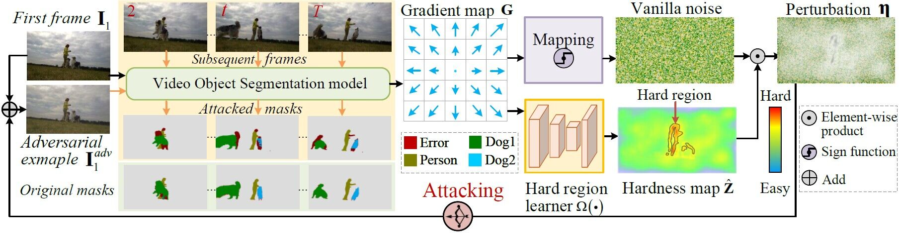
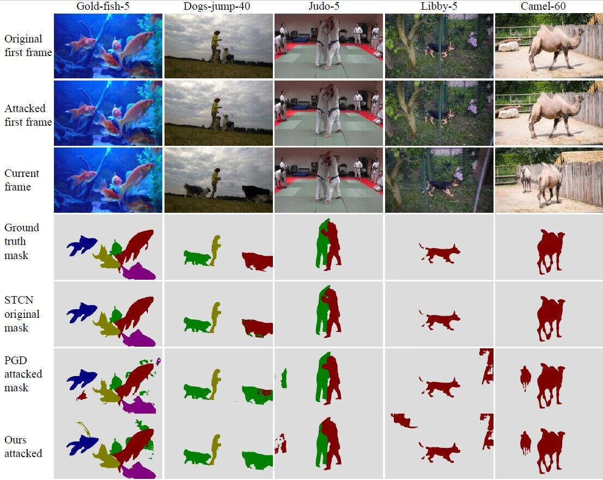

# Adversarial Attacks on Video Object Segmentation with Hard Region Discovery

## Introduction

Video object segmentation has been applied to various computer vision tasks, such as video editing, autonomous driving, and human-robot interaction. However, the methods based on deep neural networks are vulnerable to adversarial examples, which are the inputs attacked by almost human-imperceptible perturbations, and the adversary (\ie, attacker) will fool the segmentation model to make incorrect pixel-level predictions. This will rise the security issues in highly-demanding tasks because small perturbations to the input video will result in potential attack risks. Though adversarial examples have been extensively used for classification, it is rarely studied in video object segmentation. Existing related methods in computer vision either require prior knowledge of categories or cannot be directly applied due to the special design for certain tasks, failing to consider the pixel-wise region attack. Hence, this work develops an object-agnostic adversary that has adversarial impacts on VOS by first-frame attacking via hard region discovery. Particularly, the gradients from the segmentation model are exploited to discover the easily confused region, in which it is difficult to identify the pixel-wise objects from the background in a frame. This provides a hardness map that helps to generate perturbations with a stronger adversarial power for attacking the first frame.


<p align="center">

</p>

## Installation

1. Environment:

   - Python 3.9
   - PyTorch 1.11
   - CUDA 11.3
   - OpenCV 4.8.0
   - progressbar2


2. Dataset preparation:
   - DAVIS2017: put under `../DAVIS/`.
   
After downloading the datasets, use the commands below to generate soft links.
```
ln -s /path/to/DAVIS/* ../DAVIS/
```

After running the above commands, the data file should be like:

```
├── ARA
└── DAVIS
    ├── 2016
    │   ├── Annotations
    │   └── ...
    └── 2017
        ├── test-dev
        │   ├── Annotations
        │   └── ...
        └── trainval
            ├── Annotations
            └── ...

```

## Reproducing the results

### Pretrained models

We use the model from [STCN](https://github.com/hkchengrex/STCN/). You can download them yourself and put them in `./saves/`, or use `download_model.py`.

s012 model (better): [[Google Drive]](https://drive.google.com/file/d/1mRrE0uCI2ktdWlUgapJI_KmgeIiF2eOm/view?usp=sharing) [[OneDrive]](https://uillinoisedu-my.sharepoint.com/:u:/g/personal/hokeikc2_illinois_edu/Eav35v3GZIZFiq6dv9BM8n0BHtR1hD7QU9tcxH7hylG3dA?e=NXJpTu)

## Testing

Download and put the model weights under the current dir. Run the following command, the segmentation results on DAVIS2017 val set will be generated under the `[output-path]` dir.

```
python demo.py --output [output-path]
```

Then follow [davis2017-evaluation](https://github.com/davisvideochallenge/davis2017-evaluation) to evalute the results.

## Quantitative results on DAVIS2017.

|       | Standard result | adversarial result |
|:-----:|:----:|:----:|
| J&F mean  |  85.4   | 81.3  |

## Qualitative results 


<p align="center">
     <br>
</p>


## Citation

If you find this repo useful, please cite the following paper.
```
@misc{li2023adversarial,
      title={Adversarial Attacks on Video Object Segmentation with Hard Region Discovery}, 
      author={Ping Li and Yu Zhang and Li Yuan and Jian Zhao and Xianghua Xu and Xiaoqin Zhang},
      year={2023},
      eprint={2309.13857},
      archivePrefix={arXiv},
      primaryClass={cs.CV}
}
```
## Contact
If you have any questions, please contact Mr. Zhang Yu via email at zycs@hdu.edu.cn.

## Acknowledgement

We would like to thank the authors of [STCN](https://github.com/hkchengrex/STCN/) 
which have significantly accelerated the development of our ARA attacker. 

